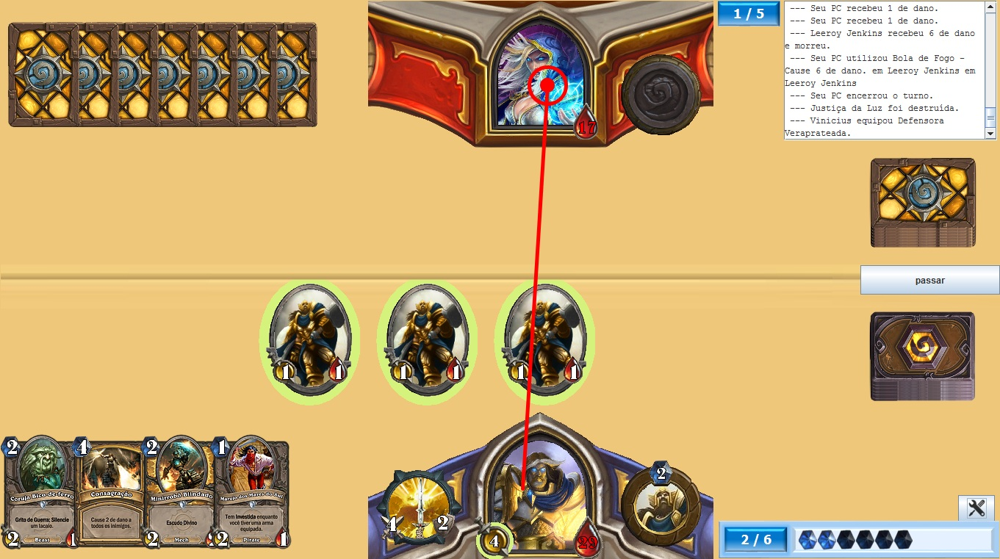
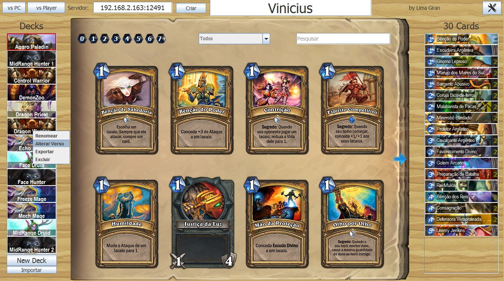
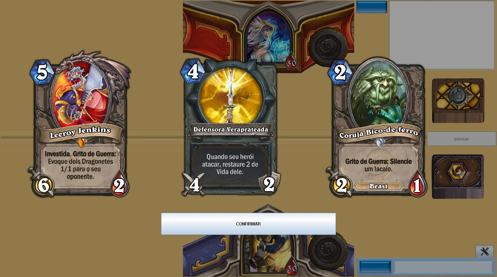

# hearthstone
Hearthstone Java - Open Source

Projeto desenvolvido a fim de aprendizado, experiência e desafio.

A última atualização foi em 02/2016, ou seja, há muitas cartas novas atualmente no HearthStone original que não foram implementadas.

Para jogar precisa ter baixado o banco de dados com as cartas e os arquivos extraídos na pasta onde se encontra HearthStone.jar. 
[**Link Dropbox**](https://dl.dropboxusercontent.com/s/sqppq9ameh4q0b5/bin.zip) 300mb (Este arquivo é baixado automaticamente ao abrir o programa). 
Ou baixar a pasta [**bin**](bin) aqui do GitHub mesmo. 
Pastas dentro da pasta bin:
 - a = arquivos de áudio
 - b = verso do card
 - m = cards no tamanho médio
 - o = cards no tamanho grande (original)
 - s = cards no tamanho pequeno
 
889 cards implementados no total (incluindo todo tipo de card, não só os colecionáveis). 
Os cards .hsi dentro das pastas são simplesmente arquivos png com extensão alterada para hsi.

Como jogar
----------
Você pode jogar contra o PC utilizando a BA implementada (BA = burrice artificial) apenas clicando no botão "vs PC", ou criar um servidor para jogar contra outro usuário.

Criando um servidor, é possível jogar pela rede utilizando o IP local ou pela internet utilizando o IP na web (com o correto redirecionamento de porta, caso seja necessário).

Clique no botão "criar" para criar um servidor. Escolha a configuração inicial do jogo e escolha uma porta para abrir o servidor.
No campo "servidor", digite: ip:porta (ex.: 192.168.0.115:12345)

Dinâmica do jogo
----------
 - Para realizar uma jogada clique com o mouse num card/lacaio/etc, arraste o mouse e solte no destino da ação, assim como é feito no jogo original.
 - Não é necessário aguardar o término da animação/execução de uma jogada para realizar outra, elas irão se acumulando.
 - Para jogar cards com ações como Grito de Guerra, arraste o card para a mesa normalmente. Após soltar o card na mesa o cursor do mouse ficará no formato de um alvo &oplus; para escolher um alvo. Clique com o botão direito para confirmar a ação; digite ESC ou clique com o botão esquerdo para cancelar a ação.
 

Contato: [Facebook](https://www.facebook.com/vini.lima.ti)

Screenshots
----------

